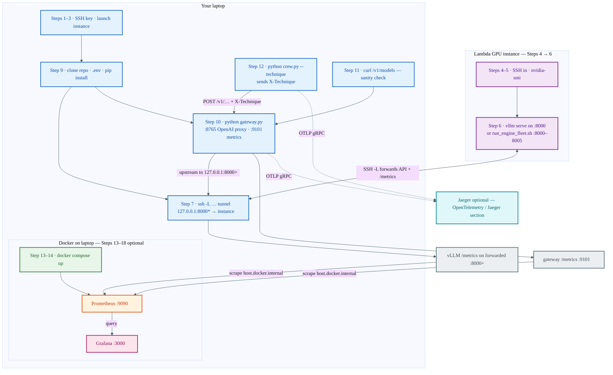
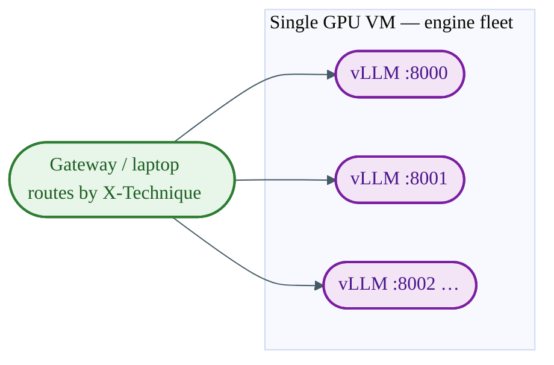
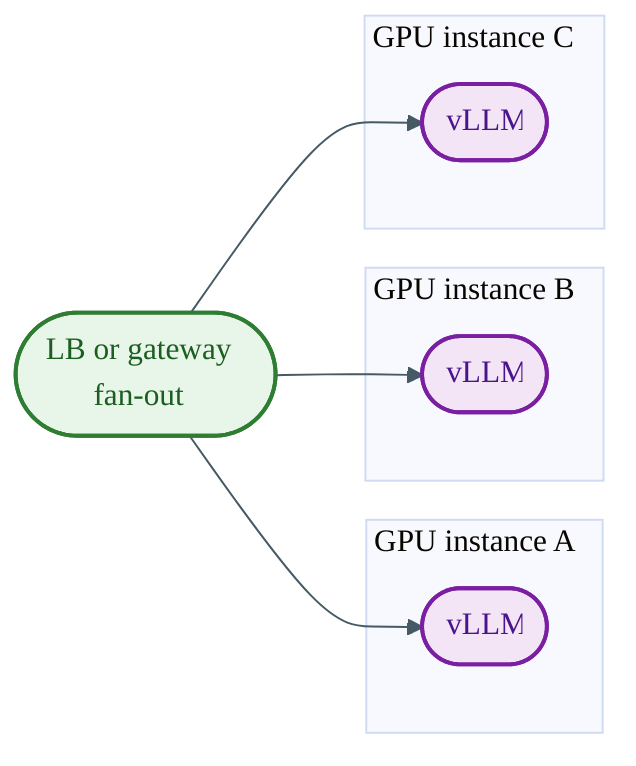
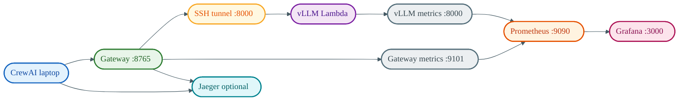

# TinyLlama + vLLM on Lambda Cloud (minimal E2E)

GPU inference runs on a **[Lambda Cloud](https://cloud.lambdalabs.com/)** instance. Your **laptop** runs the FastAPI **gateway** (metrics, tracing hooks) and **CrewAI**, talking to vLLM over an **SSH tunnel**.

**You need:** Python 3.10+ on the laptop, a Lambda account, and **Docker** on the laptop if you follow **Steps 13–18** (Prometheus + Grafana). Docker is also used for optional **Jaeger** traces.

---

## Run everything in this order

Do the steps **in sequence**. Keep **earlier** long-running steps open (Lambda SSH with vLLM, tunnel) while you do **later** steps on **new terminal tabs** on your laptop.

---

### Step 1 — Create an SSH key on your laptop

Skip if you already have a key registered with Lambda.

```bash
ssh-keygen -t ed25519 -C "your_email@example.com" -f ~/.ssh/id_ed25519_lambda -N ""
cat ~/.ssh/id_ed25519_lambda.pub
```

Copy the **full** line from the `.pub` file (starts with `ssh-ed25519`). Never share the file **without** `.pub`.

---

### Step 2 — Add that key in Lambda Cloud

1. Open **https://cloud.lambdalabs.com/** and sign in.
2. Go to **SSH keys** (account or settings).
3. **Add** a key and paste the **public** line. Save.

---

### Step 3 — Launch a GPU instance in Lambda

1. Open **Instances** → **Launch instance** (or equivalent).
2. Pick a **region** and a **GPU** type (e.g. **1× A10** is plenty for TinyLlama 1.1B).
3. **Base image:** choose **Lambda Stack 24.04** or **Lambda Stack 22.04** (or the console label **Lambda Stack 2**). That image includes the NVIDIA driver, CUDA, and Python. Do **not** pick plain **Ubuntu Server** unless you plan to install the GPU stack yourself. Details: [Lambda base images](https://docs.lambda.ai/public-cloud/on-demand/#base-images).
4. If asked for a **filesystem:** choose **Don’t attach** unless you want paid persistent storage; TinyLlama is fine on the instance disk.
5. If asked for **firewall rulesets:** pick one that allows **inbound SSH (port 22)**. You do **not** need to open port **8000** to the internet if you use the SSH tunnel in Step 7.
6. Select your **SSH key** from Step 2.
7. **Launch** and wait until the instance is **running**.
8. Copy the instance **public IP** and the **ssh** command Lambda shows (user is usually `ubuntu`).

You pay while the instance runs; **terminate** it when done to stop billing.

---

### Step 4 — SSH from your laptop into the instance

```bash
ssh -i ~/.ssh/id_ed25519_lambda ubuntu@<INSTANCE_IP>
```

If this fails: confirm the instance is running, port 22 is allowed, and the key matches.

---

### Step 5 — On the instance: confirm the GPU

```bash
nvidia-smi
```

You should see an NVIDIA GPU. If you get **`command not found`** or no GPU, you likely chose a **CPU-only** SKU or the wrong image — terminate and launch again with a **GPU** type and **Lambda Stack** (Step 3). Do not try to “fix” a CPU instance with `apt install nvidia-utils` only.

---

### Step 6 — On the instance: install vLLM and start the server

Still **inside the SSH session** from Step 4. Leave this terminal open with **`vllm serve`** running in the foreground.

```bash
sudo apt update && sudo apt install -y python3-venv python3-pip
python3 -m venv ~/vllm-env
source ~/vllm-env/bin/activate
pip install -U pip wheel
pip install "vllm==0.13.0"

vllm serve TinyLlama/TinyLlama-1.1B-Chat-v1.0 \
  --served-model-name texttinyllama \
  --host 0.0.0.0 \
  --port 8000
```

Equivalent from the repo (run on the **GPU** from a checkout of this project, or after copying **`scripts/vllm_engine/`**):

```bash
bash scripts/vllm_engine/baseline.sh
```

Other **engine-arg** profiles (chunked prefill, prefix caching, speculative, …) live in the same folder; flags follow the [vLLM **Engine arguments**](https://docs.vllm.ai/en/stable/configuration/engine_args/) reference.

**Gateway + Crew cannot “send” engine flags over HTTP.** vLLM reads chunked prefill, prefix cache, speculative config, etc. only at **`vllm serve`** startup. To pick an engine per **`python crew.py --technique …`** without restarting servers between arms, run **one vLLM per port** on the instance and let the gateway route by technique:

1. On the **GPU host:** `bash scripts/vllm_engine/run_engine_fleet.sh` (starts **:8000** … **:8005** with the same flags as the individual `*.sh` scripts). Optional **:8005** needs **`VLLM_SPECULATIVE_CONFIG_JSON`** set first. Several processes on one GPU may OOM for larger models — use a small model or stop processes you are not testing.
2. On the **laptop:** **`VLLM_BASE_URL=http://127.0.0.1:8000`**, **`VLLM_AUTO_ENGINE_ROUTING=1`** in **`.env`**, restart **`python gateway.py`**. **`GET /health`** lists **`backend_map_keys`** when routing is on.
3. **SSH tunnel** every forwarded port (Step 7 example below).

Wait until you see **application startup complete**. First install and first model download can take several minutes. If `pip` fails to build, run `sudo apt install -y build-essential` and retry.

**Note:** A log line like **`GET / HTTP/1.1" 404`** is normal — the API is under **`/v1/`**, not `/`.

---

### Step 7 — On your laptop: open a **second** terminal and start the SSH tunnel

Do **not** close Step 6. In a **new** tab on the **laptop**:

```bash
ssh -i ~/.ssh/id_ed25519_lambda -L 8000:127.0.0.1:8000 -N ubuntu@<INSTANCE_IP>
```

- **`-L 8000:127.0.0.1:8000`** forwards your laptop’s **`http://127.0.0.1:8000`** to vLLM on the instance.
- **`-N`** means no remote shell — this tab only holds the tunnel. Leave it open.

**Engine fleet** ( **`run_engine_fleet.sh`** + **`VLLM_AUTO_ENGINE_ROUTING=1`** ): forward **8000–8005** in one `ssh` (one line, multiple **`-L`**):

```bash
ssh -i ~/.ssh/id_ed25519_lambda \
  -L 8000:127.0.0.1:8000 -L 8001:127.0.0.1:8001 -L 8002:127.0.0.1:8002 \
  -L 8003:127.0.0.1:8003 -L 8004:127.0.0.1:8004 -L 8005:127.0.0.1:8005 \
  -N ubuntu@<INSTANCE_IP>
```

Skip **`-L …8005`** if you did not start speculative vLLM on the instance.

---

### Step 8 — On your laptop: check vLLM through the tunnel

**Third** terminal tab on the laptop:

```bash
curl -sS http://127.0.0.1:8000/v1/models
```

You should see JSON with **`"id":"texttinyllama"`**. If this fails, fix Step 6 or Step 7 before continuing.

---

### Step 9 — On your laptop: configure the project

Use any free tab on the **laptop** (Steps 6–7 must still be running). Go to your **project root** (folder containing `requirements.txt`, `gateway.py`, `crew.py`).

```bash
cd <path-to-your-repo>
cp .env.example .env
```

Edit **`.env`** with at least:

- **`VLLM_BASE_URL=http://127.0.0.1:8000`** (no trailing slash; requires Step 7).
- **`VLLM_SERVER_PROFILE=baseline`**

Optional for **cost metrics** in `.env`: **`LAMBDA_CLOUD_API_KEY=`** (paste key from Lambda dashboard → **API keys**), **`LAMBDA_INSTANCE_TYPE=`** (e.g. `gpu_1x_a10`, or leave empty to infer), **`LAMBDA_COST_USE_API=true`**. Or set **`LAMBDA_COST_USE_API=false`** and use **`GPU_HOURLY_COST_USD`** only. See **`.env.example`**.

Install Python dependencies **on the laptop** (not on Lambda):

```bash
pip install -r requirements.txt
```

---

### Step 10 — On your laptop: start the gateway

Open a **dedicated** tab and keep it open (Steps 6, 7, 10 run until you are done):

```bash
cd <path-to-your-repo>
set -a && source .env && set +a
python gateway.py
```

Leave this running. The API is at **`http://127.0.0.1:8765/v1/...`**. Prometheus scrapes **`http://127.0.0.1:9101/metrics`** (started automatically when the app loads — same if you use **`uvicorn gateway:app`**). The app also serves **`http://127.0.0.1:8765/metrics`** for quick checks.

On startup you should see a log line like **`Prometheus scrape URL … :9101/metrics`**. If **`9101`** is already in use, stop the old gateway process or change **`GATEWAY_METRICS_PORT`** in **`.env`** and point **`monitoring/prometheus.yml`** at the new port.

**JSONL logs:** By default the gateway writes **`logs/gateway/gateway_metrics_YYYY-MM-DD.jsonl`** under the repo (gitignored). Set **`GATEWAY_METRICS_LOG_DIR=-`** in **`.env`** to turn that off.

---

### Step 11 — On your laptop: verify the gateway

With Step 10 still running, in **another** tab:

```bash
curl -sS http://127.0.0.1:8765/
```

Expect **`200`** and JSON with **`service`** / **`endpoints`** (opening **http://127.0.0.1:8765/** in a browser is fine).

```bash
curl -sS http://127.0.0.1:8765/health
```

Expect **`"status":"ok"`** if `VLLM_BASE_URL` is valid.

```bash
curl -sS http://127.0.0.1:8765/v1/models
```

Expect **`texttinyllama`** in the JSON.

**Optional chat test:**

```bash
curl -sS "http://127.0.0.1:8765/v1/chat/completions" \
  -H "Content-Type: application/json" -H "X-Technique: baseline" \
  -d '{"model":"texttinyllama","messages":[{"role":"user","content":"Say hi in five words."}],"max_tokens":32}'
```

**Metrics — readable vs raw Prometheus**

The **`/metrics`** page is **Prometheus’ text format**: every metric family repeats **`# HELP`** and **`# TYPE`**, and **histograms** print one line per bucket. That verbosity is **normal** for scrapers, not meant to be read by hand.

- **Human-friendly (this gateway only):** on the **API port** open **`http://127.0.0.1:8765/metrics/summary`** (JSON), **`?format=text`**, or **`?format=html`**. The lightweight server on **`:9101`** exposes **only** **`/metrics`** for Prometheus — use **8765** for the summary.
- **Raw `llm_gateway_*` only:** `curl -sS http://127.0.0.1:9101/metrics | grep '^llm_gateway_'`

**vLLM engine metrics** (prefill/decode, KV cache, tok/s in the vLLM style) are **not** inside the gateway process. They are exposed by **vLLM** at **`http://127.0.0.1:8000/metrics`** (with your SSH tunnel). Prometheus should scrape that target as **`vllm_tunnel`** (see **`monitoring/prometheus.yml`**). Console log lines from **`vllm serve`** are separate from Prometheus.

After editing **`gateway.py`**, restart the gateway. See **Step 14** for Grafana.

---

### Step 12 — On your laptop: run Crew

With Steps 6, 7, and 10 still running:

```bash
cd <path-to-your-repo>
set -a && source .env && set +a
python crew.py --technique baseline
```

`crew.py` waits for **`GET /v1/models`** via the gateway (up to **`CREW_VLLM_WAIT_S`** seconds) before starting; set **`CREW_VLLM_WAIT_S=0`** in `.env` to skip that wait. Poll interval: **`CREW_VLLM_POLL_S`** (see **`.env.example`**). By default **`CREW_LLM_STREAM=true`**: LiteLLM sends **`"stream": true`** so the gateway uses the **SSE** path and JSONL / **`llm_gateway_stream_inter_chunk_*`** reflect real chunk timing. Set **`CREW_LLM_STREAM=false`** if you need non-streaming.

**Flow:** CrewAI → gateway **:8765** → tunnel → vLLM on Lambda. Model name **`texttinyllama`** must match **`--served-model-name`** on the server.

---

### Step 13 — What “full metrics” means (read this once)

- **Gateway** — **`http://127.0.0.1:9101/metrics`**: `llm_gateway_*` with `technique` + `server_profile`, latency, tokens, estimated $.
- **vLLM** — **`http://127.0.0.1:8000/metrics`** (via tunnel): engine metrics; names vary by vLLM version.
- **JSONL** — default **`logs/gateway/*.jsonl`** per request (disable with **`GATEWAY_METRICS_LOG_DIR=-`**).

Prometheus and Grafana are **Docker** images only (no `pip install` for them).

**Labels:** `crew.py --technique` sets **`X-Technique`**. **`VLLM_SERVER_PROFILE`** in **`.env`** tags which **vLLM config** you think is live — change it and **restart the gateway** after you change **`vllm serve`** so Grafana can separate runs.

---

### Step 14 — Start Prometheus + Grafana (Docker)

**Requirements:** Steps **6** (vLLM), **7** (tunnel), and **10** (gateway) are running so something answers on laptop **`127.0.0.1:8000`** and **`127.0.0.1:9101`**.

From the **repo root**:

```bash
cd monitoring
docker compose up -d
```

This starts:

- **Prometheus** at **http://127.0.0.1:9090** using **`monitoring/prometheus.yml`**, which scrapes **`host.docker.internal:9101`** (gateway) and **`host.docker.internal:8000`** (vLLM through the tunnel).
- **Grafana** at **http://127.0.0.1:3000** with the **Prometheus** datasource and dashboards **pre-provisioned** (no manual “Add data source” if you use this compose file).

**Linux note:** The compose file sets **`extra_hosts: host.docker.internal:host-gateway`** on Prometheus so the same config works as on macOS. If a target still fails, confirm Docker is recent enough for **`host-gateway`**, or temporarily run Prometheus on the host instead of in Docker.

**Sanity check — Prometheus targets**

Open **http://127.0.0.1:9090/targets**. You want **`gateway`** and **`vllm_tunnel`** in **UP** state.

- **DOWN on `gateway`:** Step 10 not running, wrong port, or firewall.
- **DOWN on `vllm_tunnel`:** Step 6 or **7** not running, or vLLM not listening on **8000** on the instance.

**Fallback without Compose** (two separate containers, from **repo root**):

```bash
docker run -d --name prom -p 9090:9090 \
  --add-host=host.docker.internal:host-gateway \
  -v "$PWD/monitoring/prometheus.yml:/etc/prometheus/prometheus.yml:ro" \
  prom/prometheus:latest

docker run -d --name graf -p 3000:3000 grafana/grafana:latest
```

With the fallback you must **add the Prometheus datasource manually** in Grafana (**URL `http://host.docker.internal:9090`** on Mac/Win Docker Desktop, or your host IP on Linux) and **import** the JSON files under **`monitoring/grafana_dashboards/`** (Dashboards → Import → upload each file).

---

### Step 15 — Open Grafana and use the dashboards

1. Open **http://127.0.0.1:3000**.
2. Log in as **`admin` / `admin`** and set a new password when prompted.
3. **Dashboards** → folder **TinyLlama**. Start with **TinyLlama — GPU, runs & cost**; use the others for detail (gateway timings, technique cost, vLLM engine). If vLLM panels are empty, check **http://127.0.0.1:8000/metrics** for real metric names and adjust queries in Grafana.

**Sanity:** **http://127.0.0.1:9090/graph** → query **`llm_gateway_info`** → expect **`extended_timing="true"`** (otherwise restart gateway from current **`gateway.py`**).

---

### Step 16 — Generate traffic so the graphs move

With Grafana open (time range **Last 1 hour** or **Last 15 minutes**):

1. Run a chat via the gateway (Step 11 **`curl`** is enough), or **`python crew.py --technique baseline`** (Step 12).
2. Wait one or two **Prometheus scrape intervals** (15s in **`prometheus.yml`**).
3. Refresh **TinyLlama — GPU, runs & cost** (or wait for auto-refresh).

**Labeled histograms** (`technique`, `server_profile`) only get data after at least one request used that label pair. The first run after a restart may look sparse until you’ve exercised each combination.

**Local JSONL** (same events as metrics): default directory **`logs/gateway/`** is created on first request after startup unless **`GATEWAY_METRICS_LOG_DIR=-`**. Files: **`gateway_metrics_YYYY-MM-DD.jsonl`** (UTC day). **`logs/`** is gitignored.

---

### Step 17 — Different vLLM engine settings (A/B)

Engine flags are documented in [vLLM engine arguments](https://docs.vllm.ai/en/stable/configuration/engine_args/). **`crew.py --technique`** sets **`X-Technique`**; with **`VLLM_AUTO_ENGINE_ROUTING=1`** the gateway maps **`baseline`**, **`chunked_prefill`**, **`prefix_caching`**, **`chunked_prefill_and_prefix_caching`**, **`baseline_strict`**, **`speculative_decoding`**, and **`beam_search`** (same upstream as baseline) to **ports** **8000–8005** derived from **`VLLM_BASE_URL`** (see Step 6 / **`.env.example`**). Run the fleet on the GPU host, multi-port tunnel on the laptop, then e.g. **`python crew.py --technique chunked_prefill`**.

**One process at a time** (no auto routing): on the **GPU**, from repo root (or copy **`scripts/vllm_engine/`** there):

```bash
bash scripts/vllm_engine/baseline.sh
bash scripts/vllm_engine/chunked_prefill.sh
bash scripts/vllm_engine/prefix_caching.sh
bash scripts/vllm_engine/chunked_prefill_and_prefix_caching.sh
bash scripts/vllm_engine/baseline_strict.sh   # optional hard control; drop if your vLLM rejects the flags

export VLLM_SPECULATIVE_CONFIG_JSON='{"method":"eagle","model":"YOUR/DRAFT","num_speculative_tokens":3}'
bash scripts/vllm_engine/speculative_decoding.sh
```

**All profiles at once (matches auto routing ports):** **`bash scripts/vllm_engine/run_engine_fleet.sh`**.

Use **`VLLM_SERVE_PORT=8001`** (etc.) in front of any single-script line when you manage ports manually. Spec JSON must match your vLLM version — see [speculative decoding](https://docs.vllm.ai/en/stable/features/speculative_decoding/).

**Beam** is per-request, not a global serve flag here: run **`python crew.py --technique beam_search`** vs **`baseline`** against the same server.

**After each server config:** set **`VLLM_SERVER_PROFILE`** in **`.env`**, **restart `python gateway.py`**, then run Crew. Compare Grafana by **`server_profile`**.

**Guided A/B** (prints each arm, you restart vLLM + gateway between prompts):

```bash
./scripts/run_server_ab.sh sequential
```

**Parallel** (one vLLM per port; set **`VLLM_BACKEND_MAP_JSON`** in **`.env`** like **`.env.example`**, restart gateway, then):

```bash
./scripts/run_server_ab.sh parallel
```

**Label-only sweep** (same `vllm serve`, different `X-Technique` — not a server flag test):

```bash
./scripts/run_experiments.sh
```

---

### Step 18 — Monitoring troubleshooting

- **Targets DOWN** — Steps 6–7–10; `curl -sS http://127.0.0.1:9101/metrics` and `curl -sS http://127.0.0.1:8000/metrics`.
- **Grafana empty** — Widen time range; in Prometheus **Graph** try `llm_gateway_requests_total`.
- **No `llm_gateway_*`** — Restart gateway from current **`gateway.py`** (9101 opens on app startup).
- **9101 refused** — Port in use or old process; **`8765/metrics`** may still work.
- **vLLM panels empty** — Metric renames; explore **`{job="vllm_tunnel"}`** in Prometheus.
- **Port / duplicate containers** — `cd monitoring && docker compose down` or `docker rm -f prom graf`.

---

## If something goes wrong

1. **SSH permission denied** — Wrong key, user, or key not added in Lambda (Steps 1–2).
2. **`nvidia-smi` not found on Lambda** — Wrong instance type or image; redo Step 3 with a **GPU** SKU and **Lambda Stack**.
3. **`libcuda` / device errors in Python on Lambda** — Same as (2); GPU not visible.
4. **`connection refused` on laptop `127.0.0.1:8000`** — Step 6 not running, or Step 7 tunnel not running, or vLLM not bound to `0.0.0.0:8000`.
5. **`connection refused` on `127.0.0.1:8765`** — Step 10 not running or wrong directory/env.
6. **Gateway `/health` not `"ok"`** — Fix `VLLM_BASE_URL` in `.env` (must be tunnel URL **`http://127.0.0.1:8000`** for this guide).
7. **`Failed to export traces … 4317`** — Start Jaeger (optional section below) or set **`OTEL_TRACES_EXPORTER=none`** in `.env`.
8. **Crew LLM errors** — Run Step 11 **`/v1/models`** through the gateway; ensure tunnel and vLLM are up.
9. **`apt full-upgrade` errors on Lambda Stack 24.04** — Known Lambda caveat; see [Lambda base images / troubleshooting](https://docs.lambda.ai/public-cloud/on-demand/#base-images).
10. **Grafana empty / Prometheus targets red** — **Step 18**; confirm **`docker compose`** from **`monitoring/`** and that Steps **6–7–10** are running.

---

## Optional: OpenTelemetry traces (Jaeger)

Separate from Prometheus (request spans, not histograms). Same **Docker** dependency as Step 14.

```bash
docker run -d --name jaeger -p 16686:16686 -p 4317:4317 jaegertracing/all-in-one:latest
```

In **`.env`**: **`OTEL_TRACES_EXPORTER=otlp`** and **`OTEL_EXPORTER_OTLP_*=http://127.0.0.1:4317`**. Restart **`python gateway.py`**, run **`python crew.py`**, open **http://127.0.0.1:16686** (services **`crewai`**, **`gateway`**; match **`X-Trace-Id`** from responses).

---

## Optional: run vLLM in Docker on Lambda (instead of Step 6 pip)

Use if you want a containerized vLLM. Lambda Stack often already has Docker + NVIDIA Container Toolkit; try **`docker run --gpus all ...`** first. Otherwise install the toolkit per [NVIDIA’s guide](https://docs.nvidia.com/datacenter/cloud-native/container-toolkit/latest/install-guide.html).

```bash
docker run --gpus all --ipc=host -p 8000:8000 \
  -v "$HOME/.cache/huggingface:/root/.cache/huggingface" \
  vllm/vllm-openai:latest \
  --model TinyLlama/TinyLlama-1.1B-Chat-v1.0 \
  --served-model-name texttinyllama \
  --host 0.0.0.0 \
  --port 8000
```

Pin a tag from [Docker Hub](https://hub.docker.com/r/vllm/vllm-openai) instead of `:latest` if you want a fixed version. Use **`docker run -d`** to keep the server running after you disconnect (see Docker docs for logs).

Then continue from **Step 7** unchanged.

---

## Architecture

### End-to-end flow (README order)

Step numbers match the **Steps** sections above. Solid lines: request path and Prometheus scrape path. Dashed: optional traces.



**Auto engine routing (Step 6 / 17):** with **`VLLM_AUTO_ENGINE_ROUTING=1`**, the gateway maps **`--technique`** to different **localhost ports**; the tunnel must forward each **8000–8005** you use. **Beam search** stays one server: the gateway injects **`use_beam_search`** on the JSON body.

### Engine fleet and scaling (compared)

**Engine fleet** means **several `vllm serve` processes** on **one** cloud GPU instance (different ports, different engine flags). That is **not** horizontal scaling — you still have a **single VM** sharing **one** GPU’s VRAM.

#### Engine fleet — one instance, multiple vLLM servers



#### Horizontal scaling — more instances (scale out)

Add **separate** GPU VMs; a **load balancer** or **smart gateway** sends traffic to instance A, B, C… Each box usually runs **one** vLLM (same config) to add **throughput** and **isolation**.



#### Vertical scaling — bigger GPU on one instance (scale up)

Keep **one** VM; move to a **larger SKU** (more VRAM / faster GPU). Still typically **one** vLLM process — you get **headroom**, not extra machines.


---

### Components and data paths



**Metrics vs traces:** Samples flow **gateway / vLLM** → **Prometheus** → **Grafana** (pull + query). **Jaeger** receives **OTLP traces** from Crew and the gateway only. The Compose stack provisions **Prometheus** for Grafana; dashboards **link** out to the Jaeger UI for traces.

---

## Repo files (quick reference)

- **`gateway.py`** — Proxy, Prometheus (`llm_gateway_*`), OTel, cost estimate, beam injection, optional **`VLLM_AUTO_ENGINE_ROUTING`** to engine-fleet ports.
- **`crew.py`** — Crew workflow, **`--technique`**, upstream wait, OTLP flush.
- **`lambda_pricing.py`** — Optional Lambda API hourly price for cost metrics.
- **`scripts/run_experiments.sh`** — Run crew once per technique label (client labels only).
- **`scripts/vllm_engine/*.sh`** — **`vllm serve`** one-liners with different [engine args](https://docs.vllm.ai/en/stable/configuration/engine_args/) (baseline, chunked prefill, prefix cache, speculative, …); **`run_engine_fleet.sh`** starts the full set on **8000–8005** for **`VLLM_AUTO_ENGINE_ROUTING`** in **`gateway.py`**.
- **`scripts/run_server_ab.sh`** + **`scripts/ab_arms.sh`** — Drive Crew after each arm; **`ab_arms.sh`** HINTs point at **`vllm_engine/`** scripts.
- **`monitoring/docker-compose.yml`** — Prometheus + Grafana with datasource and dashboard provisioning.
- **`monitoring/prometheus.yml`** — Scrape **gateway** and **vLLM** on the laptop (tunnel + **`host.docker.internal`**).
- **`monitoring/grafana/provisioning/`** — Auto-add Prometheus datasource when using Compose.
- **`monitoring/grafana_dashboards/`** — Dashboard JSON (import manually if you use raw **`docker run`** for Grafana only).

---
